# Hi! 👋 I'm Saahil

SDE-2 @ Cedar Gate Technologies 💼

I'm someone who gets excited about understanding *how things actually work*. Right now, that means diving into operating systems, networking, and AI/ML — not just to use them, but to really get what's happening under the hood.

I love building things that solve real problems, and I believe good software comes from understanding fundamentals rather than just stacking frameworks.

## 🛠️ What I Work With

**Languages I enjoy:**

**Frameworks I use:**

I'm pretty framework-agnostic — I pick up tools based on what the project needs. That said, I do have a thing for Go Fiber when I need something fast and elegant.

## 🌱 Currently Learning

📚 Core CS concepts (OS & Networking)  
🤖 AI & Machine Learning  
🏗️ System Design patterns

## 📫 Let's Connect

## 📊 GitHub Stats

## 🏅 Holopin Badges

